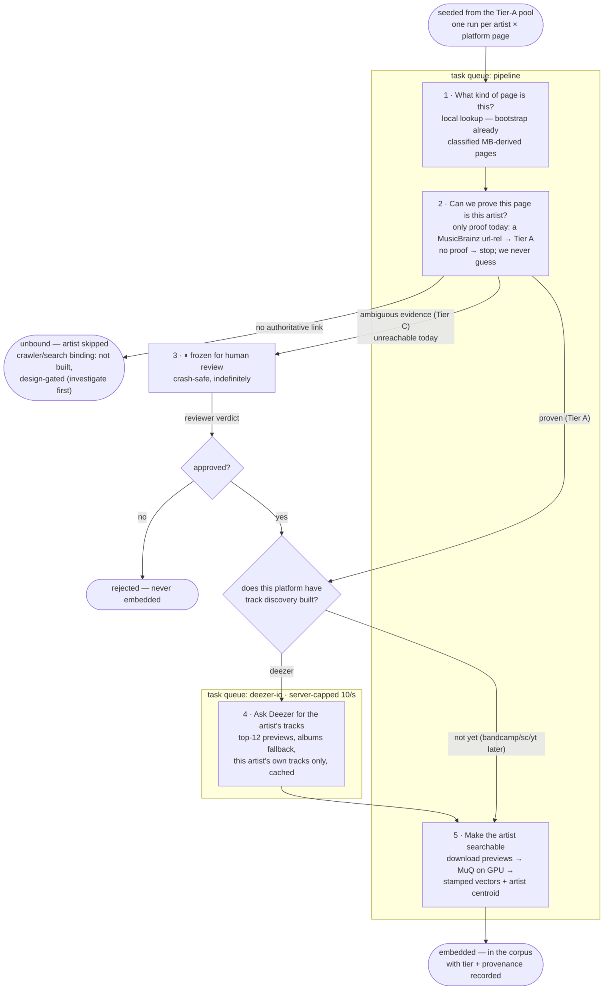
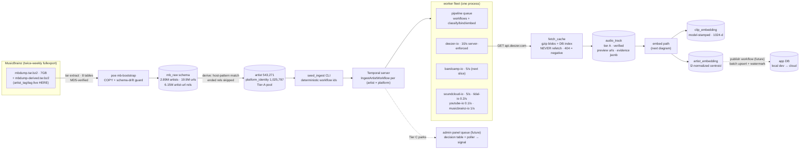
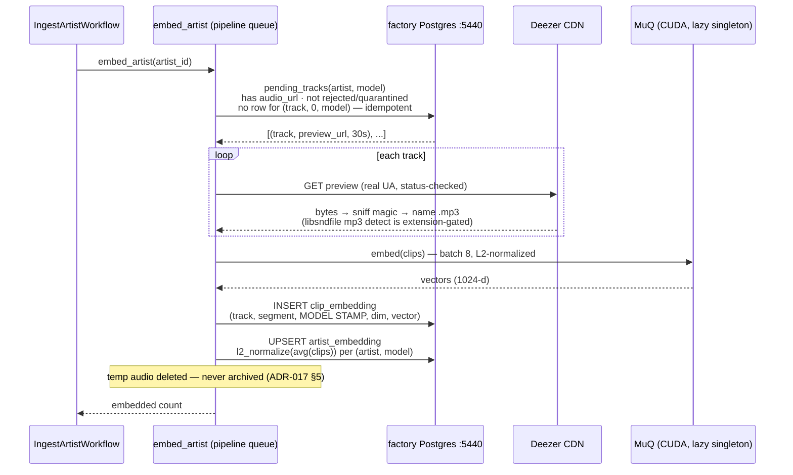

# Pipeline workflows — as built

Diagrams of what actually runs (ADR-016/ADR-017). Maintained per-slice: if a
slice changes a flow, its commit updates the diagram. Dashed elements are
designed-but-not-built; everything solid has run for real against the factory
DB. Verified live 2026-06-09: Burial (deezer 6281) — 12 tracks discovered,
12 MuQ clips embedded, centroid committed.

## IngestArtistWorkflow — per-artist orchestration

One workflow per (artist × platform identity), id `ingest-{platform}-{platform_id}`
(deterministic → seeding is idempotent). The Tier-C park is the reason Temporal
exists here: a parked workflow survives crashes for as long as review takes.

What each step actually does:

1. **Classify** — "do we already know what kind of page this is?" A local DB
   read: MB-derived pages were classified at bootstrap (artist/label/etc.).
   No network. Unknown pages stay unknown until a future slice classifies live.
2. **Bind** — "can we PROVE this page belongs to this artist?" Today the only
   accepted proof is a MusicBrainz url-rel (→ Tier A). No proof → the workflow
   ends `unbound` and **nothing is crawled, searched, or guessed**. Search/
   crawler-based binding (Tier B/C evidence scoring) does not exist yet — it is
   design-gated: thorough investigation + empirical testing before any code,
   then the 1k-artist calibration before it touches the corpus (ADR-017 §3).
3. **Review park (Tier C)** — when bind one day yields ambiguous evidence, the
   workflow freezes here, crash-safe, until a human signals a verdict. Wired
   but unreachable today (nothing produces Tier C yet).
4. **Discover** — "ask the platform what this artist's tracks are." Runs on the
   platform's own rate-capped queue through the fetch cache. Deezer only, so
   far: top-12 previews, albums fallback, main-artist tracks only.
5. **Embed** — "turn the tracks into corpus vectors." Download previews, run
   MuQ on the GPU, store model-stamped clip vectors, refresh the artist's
   centroid. The artist is now in the similarity space.

## System data flow — bootstrap to corpus

## Inside embed_artist

## Status legend

| Built + verified live | Designed, not built (dashed) |
|---|---|
| MB bootstrap, Tier-A bind/classify, deezer-io discovery, fetch cache, embed path, centroids, seeder | Publish workflow, admin review wiring, B-tier search (3d), Bandcamp/SC/YT discovery, Tidal trickle |

**Explicitly not built and design-gated: crawler/search-based artist discovery.**
Binding artists without an MB url-rel (platform search, evidence scoring,
triangulation — Tier B1/B2/C) requires its own investigation + empirical
testing cycle before any implementation, and the 1k-artist calibration run
before it feeds the corpus (ADR-017 §3). Until then, no-proof artists end
`unbound` — by design, not omission.
