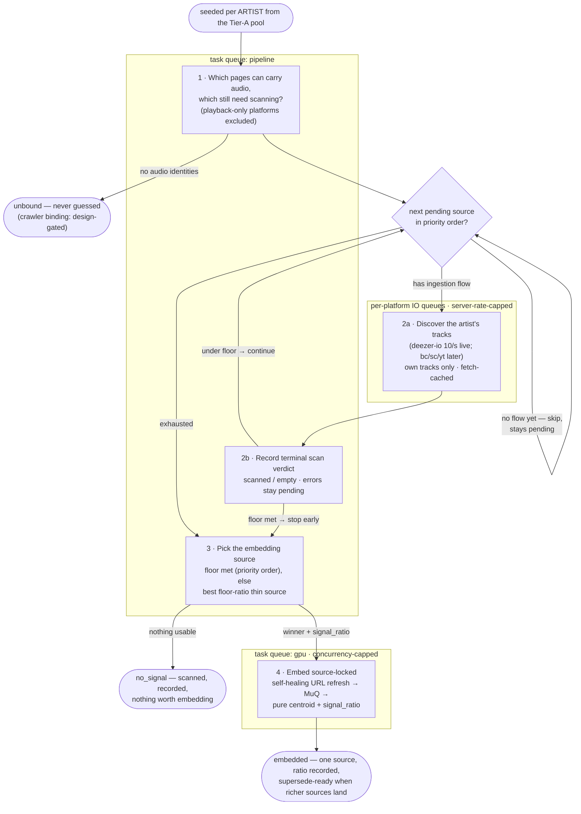
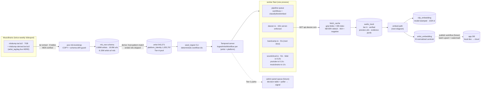
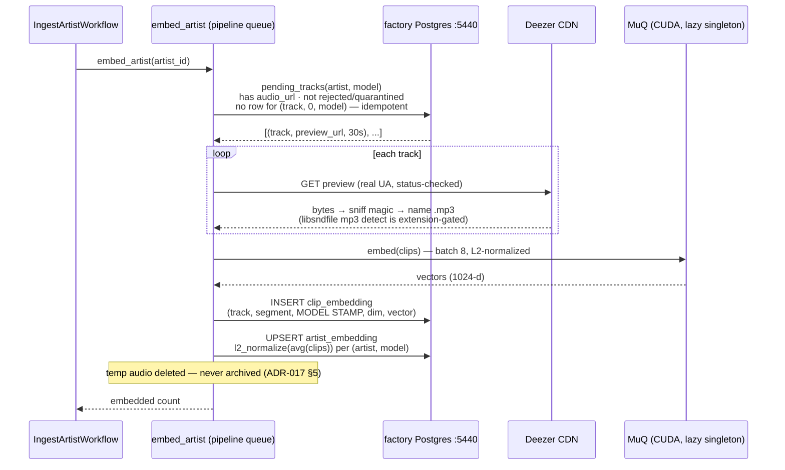

# Pipeline workflows — as built

Diagrams of what actually runs (ADR-016/ADR-017). Maintained per-slice: if a
slice changes a flow, its commit updates the diagram. Dashed elements are
designed-but-not-built; everything solid has run for real against the factory
DB. Verified live 2026-06-09: Burial (deezer 6281) — 12 tracks discovered,
12 MuQ clips embedded, centroid committed.

## IngestArtistWorkflow — the audio-source cascade

One workflow per ARTIST, id `ingest-artist-{artist_id}` (deterministic →
re-seeding is idempotent; scan verdicts make re-runs cheap). The cascade walks
the artist's audio-role identities in signal-priority order and embeds from
exactly one source — centroid purity is enforced in SQL, not by convention.

What each step actually does:

1. **Plan** — "which of this artist's pages can carry audio, and which still
   need scanning?" Local DB read over MB-derived identities. Tidal/Apple/Qobuz
   are playback assets and never enter the cascade. No audio identities at all
   → `unbound`; **nothing is crawled, searched, or guessed** (crawler binding
   stays design-gated).
2. **Cascade scan** — for each pending source in priority order (deezer →
   bandcamp → soundcloud → youtube): discover its tracks on the platform's
   rate-capped queue, write the TERMINAL scan verdict (`scanned`/`empty` —
   transient errors leave `pending` for retry), and **stop early when a source
   meets its floor** (deezer 10 · bc/sc 3 · yt experimental). Sources without
   an ingestion flow yet are skipped and stay pending.
3. **Choose** — floors double as equal-signal normalizers: first source meeting
   its floor (priority order) wins; if none does, the best THIN source wins by
   floor-ratio (2 BC tracks at 2/3 beat 1 Deezer preview at 1/10). Nothing
   anywhere → `no_signal`.
4. **Embed, source-locked** — download the winner's audio (self-healing URL
   refresh on 403), MuQ on the GPU queue, stamped clips, centroid built ONLY
   from the winning source's clips, `signal_ratio` recorded for downstream
   gating, `artist.embedding_source` locked. A later richer source supersedes
   by re-running this — the centroid flips wholesale, never blends.

## System data flow — bootstrap to corpus

## Inside embed_artist

## Status legend

| Built + verified live | Designed, not built (dashed) |
|---|---|
| MB bootstrap, Tier-A bind/classify, deezer-io + bandcamp-io discovery, fetch cache, windowed embed path (RMS peaks), Wave-1 analysis heads (fingerprint/MIR/integrity flags/MuLan tags, decode-once), centroids, cascade, seeder | Publish workflow, admin review wiring, B-tier search (3d), SC/YT discovery, Tidal trickle, Wave-2/3 heads, tag-score calibration |

**Explicitly not built and design-gated: crawler/search-based artist discovery.**
Binding artists without an MB url-rel (platform search, evidence scoring,
triangulation — Tier B1/B2/C) requires its own investigation + empirical
testing cycle before any implementation, and the 1k-artist calibration run
before it feeds the corpus (ADR-017 §3). Until then, no-proof artists end
`unbound` — by design, not omission.
