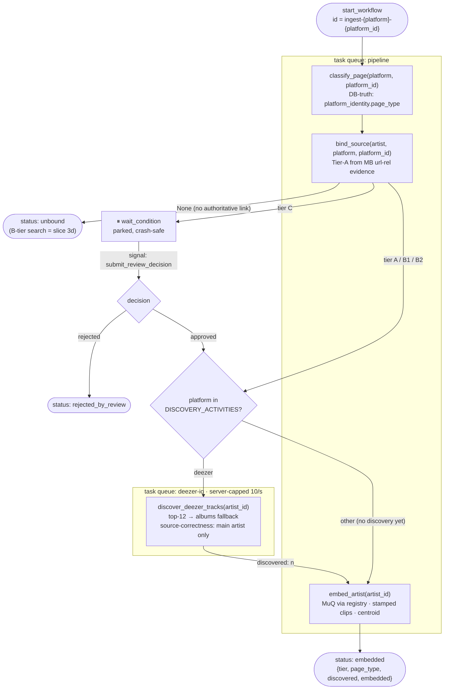
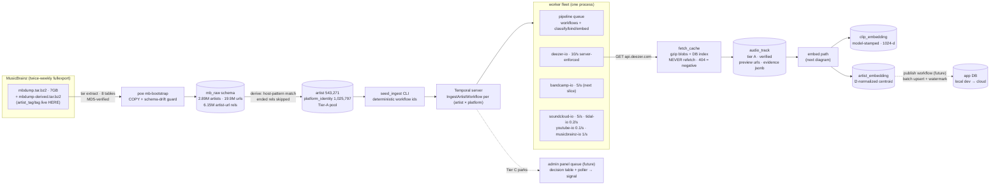
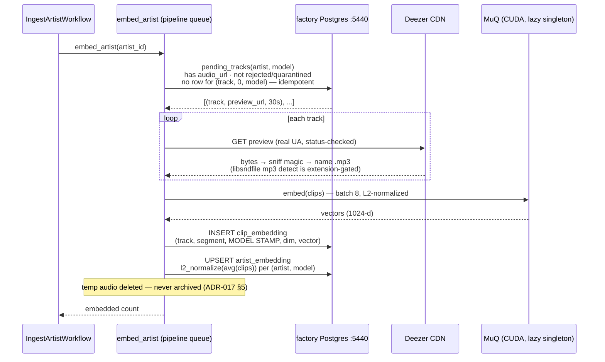

# Pipeline workflows — as built

Diagrams of what actually runs (ADR-016/ADR-017). Maintained per-slice: if a
slice changes a flow, its commit updates the diagram. Dashed elements are
designed-but-not-built; everything solid has run for real against the factory
DB. Verified live 2026-06-09: Burial (deezer 6281) — 12 tracks discovered,
12 MuQ clips embedded, centroid committed.

## IngestArtistWorkflow — per-artist orchestration

One workflow per (artist × platform identity), id `ingest-{platform}-{platform_id}`
(deterministic → seeding is idempotent). The Tier-C park is the reason Temporal
exists here: a parked workflow survives crashes for as long as review takes.

## System data flow — bootstrap to corpus

## Inside embed_artist

## Status legend

| Built + verified live | Designed, not built (dashed) |
|---|---|
| MB bootstrap, Tier-A bind/classify, deezer-io discovery, fetch cache, embed path, centroids, seeder | Publish workflow, admin review wiring, B-tier search (3d), Bandcamp/SC/YT discovery, Tidal trickle |
